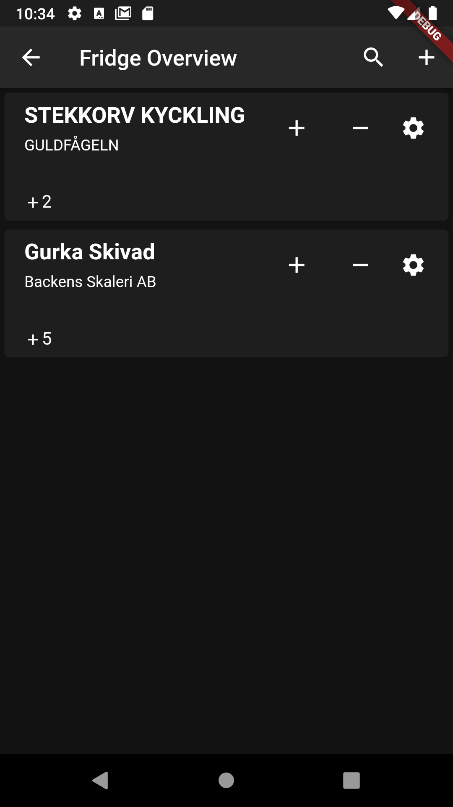

# Foodload Flutter
This is the mobile application of the project and is built with Flutter. For authentication the Firebase SDK is used and for real time updates SocketIO is used.

## User functionalities implemented
* Search for items with QR scan, ID, or text and add/remove/move/increment/decrement items for storages
* Retrieve items for storages and keep them updated in real time
* Create and modify templates as well as generate buying lists
* Sign in with Google

## Setup
Firebase setup needs to be configured and the keys.dart file needs to be updated with own variables.

## Screenshots

  
  
  
  
  
  
  
  
  
  
  
  

